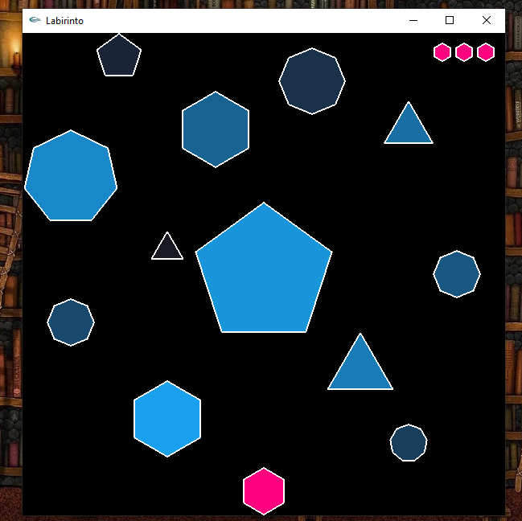
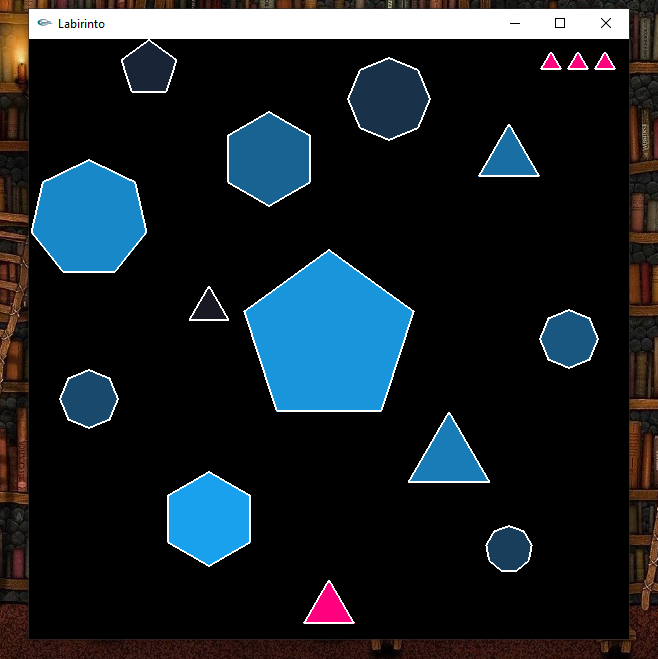
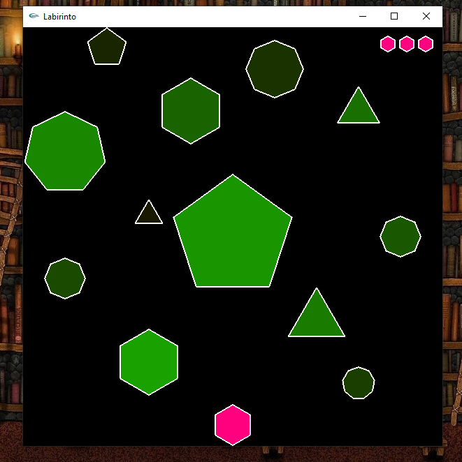
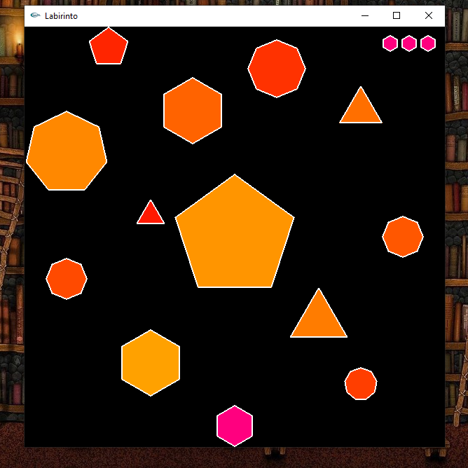

# Maze-Game
Implementação com OpenGL/GLUT de um "labirinto", ambiente com diversos obstáculos em que o player possue 3 oportunidades de ir do extremo inferior ao extremo superior da tela (2019)

## Controles:
- Setas do teclado movimentam para cima, baixo, esqueda e direita.
- Teclas PageUp e PageDown giram o player no sentido anti-horário e horário, respectivamente.
- Números de 3 a 6 mudam a forma do player quando ele está na posição inicial.
- O botão esquerdo do mouse pode ser usado para trocar a cor dos obstáculos.
- Tecla ESC pode ser usada a qualquer momento para sair do labirinto.

## Dependências
- [OpenGL/GLUT](http://www.univasf.edu.br/~jorge.cavalcanti/configcb.html)

## Screenshots

